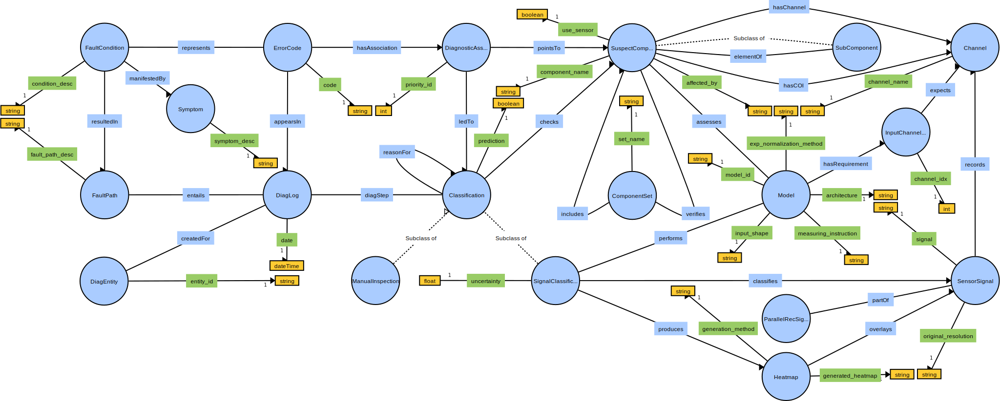

# NeSy Diagnosis Ontology


[](https://opensource.org/licenses/MIT)

> Ontology for capturing knowledge about neuro-symbolic diagnostics. The objective is to build up a knowledge graph based on this ontology by populating it with large amounts of instance data (cf. `knowledge_base/live_kg_backups/`) as well as functionalities for knowledge acquisition, enhancement and retrieval. This neuro-symbolic diagnosis ontology generalizes the [OBD ontology](https://github.com/tbohne/obd_ontology).



## Three Levels of Abstraction

- **raw ontology definition**: no instance data, just concepts with properties and relations (`knowledge_base/raw_nesy_diag_ontology.owl`)
- **diag-subject-agnostic expert knowledge**
- **diag-subject-specific diagnosis knowledge** automatically generated as part of the diagnostic process (recorded sensor data, interpretations, etc., cf. [nesy_diag_smach ](https://github.com/tbohne/nesy_diag_smach))

All three levels combined constitute the knowledge graph (`knowledge_base live_kg_backups/`).

## Dependencies

- for Python requirements, cf. `requirements.txt`
- [**Apache Jena Fuseki**](https://jena.apache.org/documentation/fuseki2/): SPARQL server hosting / maintaining the knowledge graph

## Installation
```
$ git clone https://github.com/tbohne/nesy_diag_ontology.git
$ cd nesy_diag_ontology/
$ pip install .
```

## Usage

**Run server from *Apache Jena Fuseki* root directory (runs at `localhost:3030`):**
```
$ ./fuseki-server
```

**<u>Launch knowledge graph from RDF serialization (e.g. `.nt` / `.owl` / `.ttl` file):</u>**
- navigate to `localhost:3030`
- `manage` -> `new dataset`
    - Dataset name: `nesy_diag`
    - Dataset type: `Persistent (TDB2) – dataset will persist across Fuseki restarts`
- `create dataset`
- `add data` -> `select files`
    - select knowledge graph file, e.g., `knowledge_base/test_kg.nt`
    - `upload now`

Now the knowledge graph is hosted on the *Fuseki* server and can be queried, extended or updated via the SPARQL endpoints `/nesy_diag/sparql`, `/nesy_diag/data` and `/nesy_diag/update` respectively.

**<u>Manually backup knowledge graph:</u>**
- `manage` -> `backup`

Creates a backup in `fuseki_root/run/backups/`.

The `.nq.gz` file should be extracted and the resulting `data` should be renamed to `data.nt` so that the n-triples file can be interpreted directly, e.g., when launching it on the server (see above). The backups are stored in `knowledge_base/live_kg_backups/`. For automated backups, see below.

## Enhancement of Diag-Subject-Specific Diagnosis Knowledge

The `OntologyInstanceGenerator` enhances the knowledge graph hosted by the *Fuseki* server with **diagnosis-specific instance data**, i.e., it connects the sensor readings, classifications, etc. generated during the diagnostic process, with corresponding background knowledge stored in the knowledge graph, e.g.:
```python
instance_gen = OntologyInstanceGenerator(kg_url='http://127.0.0.1:3030')
instance_gen.extend_knowledge_graph_with_diag_subject_data("1234567890ABCDEFGHIJKLMNOPQRSTUVWXYZ")
classification_instances = [
    instance_gen.extend_knowledge_graph_with_signal_classification(
        True, "diag_association_3592495", sus_comp, 0.45, "test_model_id", test_ts_id, test_heatmap_id
    ),
    instance_gen.extend_knowledge_graph_with_signal_classification(
        True, "signal_classification_3543595", sus_comp, 0.85, "test_model_id", test_ts_id, test_heatmap_id
    ),
    instance_gen.extend_knowledge_graph_with_manual_inspection(
        False, "signal_classification_45395859345", manual_sus_comp
    )
]
diag_log_uuid = instance_gen.extend_knowledge_graph_with_diag_log(
    "01.02.2024", list_of_error_codes, [test_fault_path_id], classification_instances, "diag_subject_39458359345382458"
)
```
This is used as part of [nesy_diag_smach](https://github.com/tbohne/nesy_diag_smach). All kinds of relevant diagnostic information are gathered and linked so that previously unknown correlations can be discovered by using the system.

## Knowledge Graph Query Tool

The `KnowledgeGraphQueryTool` provides a library of numerous predefined SPARQL queries and response processing to access information stored in the knowledge graph that is used in the diagnostic process, e.g.:
```python
qt = KnowledgeGraphQueryTool(kg_url='http://127.0.0.1:3030')
qt.print_res(qt.query_all_error_code_instances())
error_code = "E0001"
qt.print_res(qt.query_fault_condition_by_error_code(error_code))
qt.print_res(qt.query_suspect_components_by_error_code(error_code))
qt.print_res(qt.query_diag_subject_by_error_code(error_code))
qt.print_res(qt.query_fault_condition_instance_by_code(error_code))
qt.print_res(qt.query_error_code_instance_by_code(error_code))
...
suspect_comp_name = "C0001"
qt.print_res(qt.query_affected_by_relations_by_suspect_component(suspect_comp_name))
...
diag_subject_id = "ID2342713"
qt.print_res(qt.query_diag_subject_instance_by_id(diag_subject_id))
...
```
This is also used as part of [nesy_diag_smach](https://github.com/tbohne/nesy_diag_smach), which essentially guides the diagnostic process based on knowledge graph queries (symbolic reasoning).

## Knowledge Snapshot

The idea of the knowledge snapshot is to output the knowledge currently stored in the knowledge graph on a concept-by-concept basis. This is useful, for instance, to compare different states via `diff`. As anticipated, there are two themes to the ontology - expert knowledge and diagnostic knowledge, for each of which there is a corresponding knowledge snapshot.
```
$ python nesy_diag_ontology/knowledge_snapshot.py [--perspective {expert | diag}]
```

## Automated Backup & Knowledge Graph Snapshot Generation

```
$ ./backup_kg.sh FUSEKI_URL:PORT DATASET_NAME
```
e.g.:
```
$ ./backup_kg.sh http://127.0.0.1:3030 nesy_diag
```
This creates two files in `knowledge_base/live_kg_backups/`, one is the gzip compressed KG backup in n-triples serialization and the other is a knowledge snapshot using both perspectives (`expert` and `diag`).

## Related Publications

```bibtex
@inproceedings{10.1145/3587259.3627546,
    author = {Bohne, Tim and Windler, Anne-Kathrin Patricia and Atzmueller, Martin},
    title = {A Neuro-Symbolic Approach for Anomaly Detection and Complex Fault Diagnosis Exemplified in the Automotive Domain},
    year = {2023},
    isbn = {9798400701412},
    publisher = {Association for Computing Machinery},
    address = {New York, NY, USA},
    url = {https://doi.org/10.1145/3587259.3627546},
    doi = {10.1145/3587259.3627546},
    booktitle = {Proceedings of the 12th Knowledge Capture Conference 2023},
    pages = {35–43},
    numpages = {9},
    location = {Pensacola, FL, USA},
    series = {K-CAP '23}
}
```
