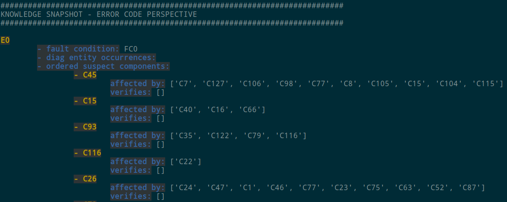

# NeSy Diagnosis Ontology


[](https://opensource.org/licenses/MIT)

> Ontology for capturing knowledge about neuro-symbolic diagnostics. The objective is to build up a knowledge graph based on this ontology by populating it with large amounts of instance data (cf. `knowledge_base/live_kg_backups/`) as well as functionalities for knowledge acquisition, enhancement and retrieval. This neuro-symbolic diagnosis ontology generalizes the [OBD ontology](https://github.com/tbohne/obd_ontology).


## Three Levels of Abstraction

- **raw ontology definition**: no instance data, just concepts with properties and relations (`knowledge_base/raw_nesy_diag_ontology.owl`)
- **diag-entity-agnostic expert knowledge**
- **diag-entity-specific diagnosis knowledge** automatically generated as part of the diagnostic process (recorded sensor data, interpretations, etc., cf. [nesy_diag_smach ](https://github.com/tbohne/nesy_diag_smach))

All three levels combined constitute the knowledge graph, e.g., `knowledge_base/129_10_10_50_10_95_99_42_98.nt`.

## Dependencies

- for Python requirements, cf. `requirements.txt`
- [**Apache Jena Fuseki**](https://jena.apache.org/documentation/fuseki2/): SPARQL server hosting / maintaining the knowledge graph

## Installation
```
$ git clone https://github.com/tbohne/nesy_diag_ontology.git
$ cd nesy_diag_ontology/
$ pip install .
```

## Usage

**Run server from *Apache Jena Fuseki* root directory (runs at `localhost:3030`):**
```
$ ./fuseki-server
```

**<u>Prepare *Fuseki*:</u>**
- navigate to `localhost:3030`
- `manage` -> `new dataset`
    - Dataset name: `nesy_diag`
    - Dataset type: `Persistent (TDB2) – dataset will persist across Fuseki restarts`
- `create dataset`

**<u>Launch existing knowledge graph from RDF serialization (e.g., `.nq.gz` / `.nt` / `.owl` / `.ttl` file):</u>**
- `add data` -> `select files`
    - select knowledge graph file, e.g., `knowledge_base/129_10_10_50_10_95_99_42_98.nt`
    - `upload now`

Now the knowledge graph is hosted on the *Fuseki* server and can be queried, extended or updated via the SPARQL endpoints `/nesy_diag/sparql`, `/nesy_diag/data` and `/nesy_diag/update` respectively.

**<u>Manually backup knowledge graph:</u>**
- `manage` -> `backup`

Creates a backup in `fuseki_root/run/backups/`.

The `.nq.gz` file does not have to be extracted. The n-triples / n-quads file can be interpreted directly, e.g., when launching it on the server (see above). The backups are stored in `knowledge_base/live_kg_backups/`. For automated backups, see below.

## Expert Knowledge Acquisition

The `ExpertKnowledgeEnhancer` can be used to augment the knowledge graph hosted by the *Fuseki* server with **entity-agnostic expert knowledge**. In particular, it generates semantic facts based on the information entered and connects these facts in a meaningful way to what is already available in the knowledge graph, i.e., it serves as a backend for the knowledge acquisition component. Finally, all generated facts are concatenated and sent to the `ConnectionController`. Quite a number of semantic facts have to be generated when few information are entered. This way, a simple knowledge graph extension for the expert goes hand in hand with an automatic proper wiring of semantic facts in the background.

Run server from *Apache Jena Fuseki* root directory (runs at `localhost:3030`):
```
$ ./fuseki-server
```
Launch raw ontology, i.e., `knowledge_base/raw_nesy_diag_ontology.owl`, then, e.g.:
```python
expert_knowledge_enhancer = ExpertKnowledgeEnhancer(kg_url='http://127.0.0.1:3030')

for k in suspect_components.keys():
    # init each component without any affected_by relations
    expert_knowledge_enhancer.add_component_to_knowledge_graph(k, [])

for k in suspect_components.keys():
    # affected_by relations
    if len(suspect_components[k][1]) > 0:
        expert_knowledge_enhancer.add_component_to_knowledge_graph(k, suspect_components[k][1])

for code in error_codes.keys():
    fault_cond = error_codes[code][0]
    associated_comps = error_codes[code][1]
    expert_knowledge_enhancer.add_error_code_to_knowledge_graph(code, fault_cond, associated_comps)
```

## Enhancement of Diag-Entity-Specific Diagnosis Knowledge

The `OntologyInstanceGenerator`, on the other hand, enhances the knowledge graph hosted by the *Fuseki* server with **diagnosis-specific instance data**, i.e., it connects sensor readings, classifications, etc. generated during the diagnostic process, with corresponding background knowledge stored in the knowledge graph, e.g.:
```python
instance_gen = OntologyInstanceGenerator(kg_url='http://127.0.0.1:3030')
instance_gen.extend_knowledge_graph_with_diag_entity_data("2342713")
classification_instances = [
    instance_gen.extend_knowledge_graph_with_signal_classification(
        prediction=True,
        classification_reason="diag_association_0",
        comp="C_A",
        uncertainty=0.45,
        model_id="test_model_id",
        signal_ids="signal_id",
        heatmap_ids="heatmap_id"
    ),
    instance_gen.extend_knowledge_graph_with_signal_classification(
        prediction=True,
        classification_reason="signal_classification_0",
        comp="C_B",
        uncertainty=0.85,
        model_id="test_model_id",
        signal_ids="signal_id",
        heatmap_ids="heatmap_id"
    ),
    instance_gen.extend_knowledge_graph_with_manual_inspection(
        prediction=False, classification_reason="signal_classification_1", comp="C_C"
    )
]
diag_log_uuid = instance_gen.extend_knowledge_graph_with_diag_log(
    diag_date="19.03.2025",
    error_code_instances=["E0"],
    fault_path_instances=["fault_path_id"],
    classification_instances=classification_instances,
    entity_id="diag_entity_2342713"
)
```
This is used as part of [nesy_diag_smach](https://github.com/tbohne/nesy_diag_smach). All kinds of relevant diagnostic information are gathered and linked so that previously unknown correlations can be discovered by deploying the system in practice.

## Knowledge Graph Query Tool

The `KnowledgeGraphQueryTool` provides a library of numerous predefined SPARQL queries and response processing to access information stored in the knowledge graph that is used in the diagnostic process, e.g.:
```python
qt = KnowledgeGraphQueryTool(kg_url='http://127.0.0.1:3030')
qt.query_all_error_code_instances()
error_code = "E0"
qt.query_fault_condition_by_error_code(error_code)
qt.query_suspect_components_by_error_code(error_code)
qt.query_diag_entity_by_error_code(error_code)
...
suspect_comp_name = "C45"
qt.query_affected_by_relations_by_suspect_component(suspect_comp_name)
...
```
E.g.:
```
$ python nesy_diag_ontology/knowledge_graph_query_tool.py

########################################################################
QUERY: suspect components for E0
########################################################################
query knowledge graph..

            SELECT ?comp_name WHERE {
                ?error_code a <http://www.semanticweb.org/nesy_diag_ontology#ErrorCode> .
                ?comp a <http://www.semanticweb.org/nesy_diag_ontology#SuspectComponent> .
                ?comp <http://www.semanticweb.org/nesy_diag_ontology#component_name> ?comp_name .
                ?da a <http://www.semanticweb.org/nesy_diag_ontology#DiagnosticAssociation> .
                ?error_code <http://www.semanticweb.org/nesy_diag_ontology#code> "E0" .
                ?da <http://www.semanticweb.org/nesy_diag_ontology#pointsTo> ?comp .
                ?error_code <http://www.semanticweb.org/nesy_diag_ontology#hasAssociation> ?da .
            }

-->  C26, C45, C93, C15, C116, C18, C73, C97, C27
```
This is also used as part of [nesy_diag_smach](https://github.com/tbohne/nesy_diag_smach), which essentially guides the diagnostic process based on knowledge graph queries (symbolic reasoning).

## Knowledge Snapshot

The idea of the knowledge snapshot is to output the knowledge currently stored in the knowledge graph on a concept-by-concept basis. This is useful, for instance, to compare different states via `diff`. As anticipated, there are two themes to the ontology - expert knowledge and diagnostic knowledge, for each of which there is a corresponding knowledge snapshot.
```
$ python nesy_diag_ontology/knowledge_snapshot.py [--perspective {expert | diag}]
```
Exemplary excerpt:



## Automated Backup & Knowledge Graph Snapshot Generation

```
$ ./backup_kg.sh FUSEKI_URL:PORT DATASET_NAME
```
e.g.:
```
$ ./backup_kg.sh http://127.0.0.1:3030 nesy_diag
```
This creates two files in `knowledge_base/live_kg_backups/`, one is the gzip compressed KG backup in n-triples serialization and the other is a knowledge snapshot using both perspectives (`expert` and `diag`).

## Related Publications

```bibtex
@article{10.1109/ACCESS.2025.3641034,
    author = {Bohne, Tim and Windler, Anne-Kathrin Patricia and Atzmueller, Martin},
    journal = {IEEE Access},
    title = {A Domain-Agnostic Neuro-Symbolic Architecture for Multimodal Human-in-the-Loop Anomaly Detection and Complex Fault Diagnosis},
    year = {2025},
    volume = {13},
    number = {},
    pages = {210201-210236},
    doi={10.1109/ACCESS.2025.3641034}
}
```
```bibtex
@inproceedings{10.1145/3587259.3627546,
    author = {Bohne, Tim and Windler, Anne-Kathrin Patricia and Atzmueller, Martin},
    title = {A Neuro-Symbolic Approach for Anomaly Detection and Complex Fault Diagnosis Exemplified in the Automotive Domain},
    year = {2023},
    isbn = {9798400701412},
    publisher = {Association for Computing Machinery},
    address = {New York, NY, USA},
    url = {https://doi.org/10.1145/3587259.3627546},
    doi = {10.1145/3587259.3627546},
    booktitle = {Proceedings of the 12th Knowledge Capture Conference 2023},
    pages = {35–43},
    numpages = {9},
    location = {Pensacola, FL, USA},
    series = {K-CAP '23}
}
```
